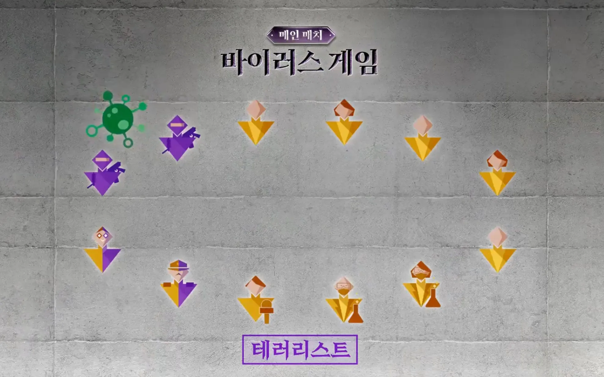

# Game 1: Virus

After every main match came a prize match where, if the players won, either ₩50,000,000 or ₩100,000,000 would be added to the prize pot. For the first prize match, players stood on a roundabout that would spin around for three minutes, with twelve sectors on it, with one player standing in each. Each player was in front of the puzzle for five seconds, with the roundabout making three rotations. 

The puzzles showed an empty geometrical shape, and were given pieces outside of the puzzle, that they had to put in the puzzle correctly. If the players completed all ten rounds, then a certain amount of won was added to the prize pot. If a player solved the puzzle twice, then they received one piece for every next puzzle solved. The prize match failed.

(Source: Wikipedia)